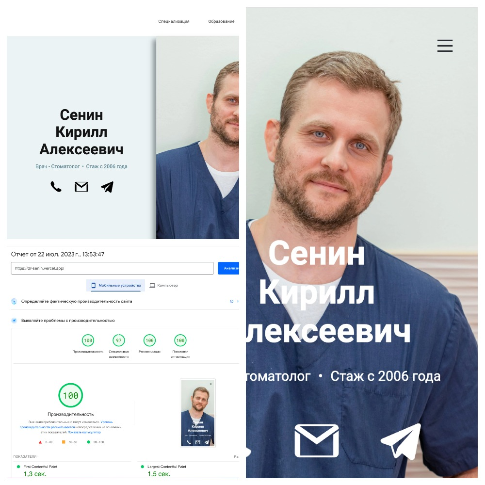

<h1 align='center'>Dr. Senin | Business card</h1>




## Запуск проекта
1) Установить зависимости

```bash
npm install
```
2) Запустить проект в режиме разработки
```bash
npm run dev
# or
yarn dev
# or
pnpm dev
```
Open [http://localhost:3000](http://localhost:3000) with your browser to see the result.

**npm run build** создает оптимизированную версию кода готовую к развертыванию на сервере
```bash
npm run build
```

<h2>Интерактивная страница-визитка врача-стоматолога</h2>

- Страница создана с помощью фреймворка Next.js для лучшей SEO оптимизации;
- Реализована адаптивная верстка;
- favicons для всех типов устройств;
